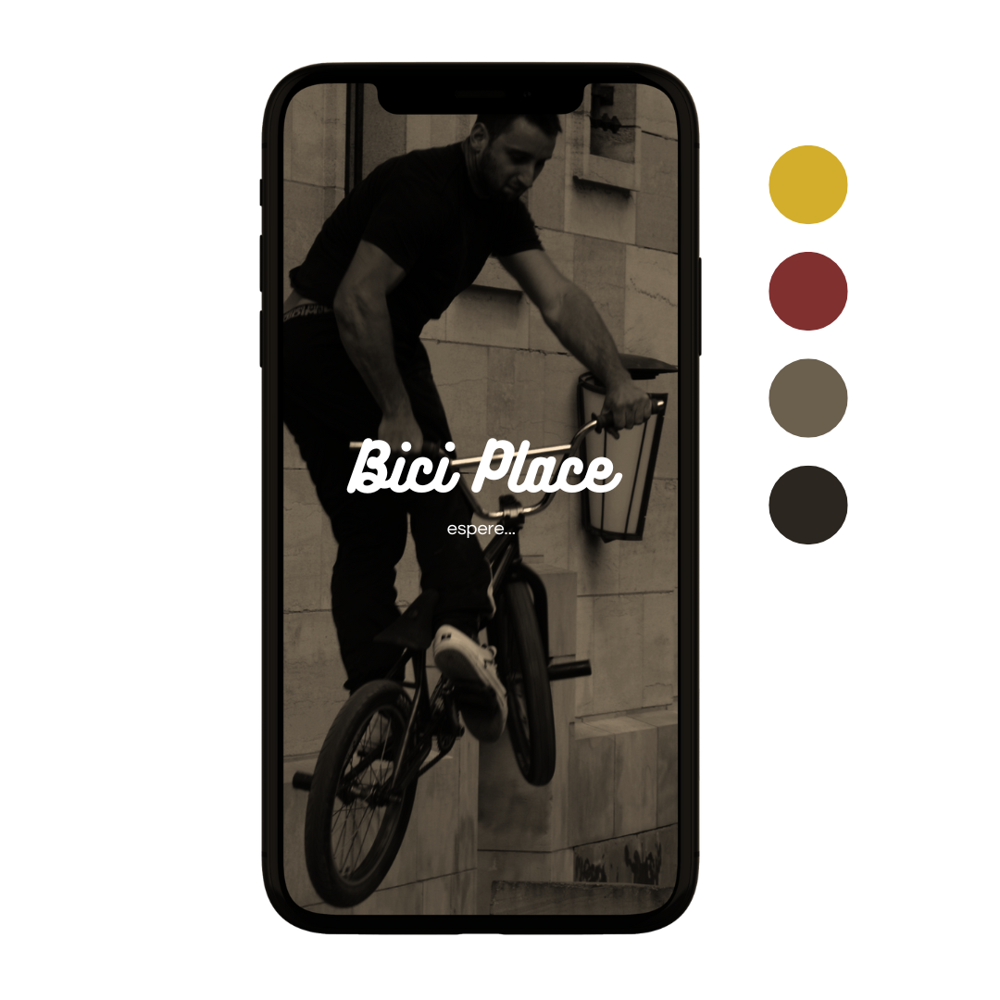

# Diseño de interfaz de usuario

La interfaz de usuario de la aplicación Bici Place esta inspirada en la interfaz de usuario de aplicaicones similares y en el uso de [Canva](https://www.canva.com/?msockid=138a4a6cd9d663cc3c7f5eb1d879623b).

El diseño completoesta disponible en [Canva](https://www.canva.com/design/DAGPLnN3uYI/pyOVnM7Hxp8m_7QMPR7WoA/edit?utm_content=DAGPLnN3uYI&utm_campaign=designshare&utm_medium=link2&utm_source=sharebutton). Los colores a usar estar[an basados en una combinación de escalas de gris, negro, rojo y amarillo. A continuación se presentan las principales pantallas:

1. Pantalla principal:
   Cuando el usuario ingrese a la aplicaicón verá una interfaz como esta:
   
    

   
