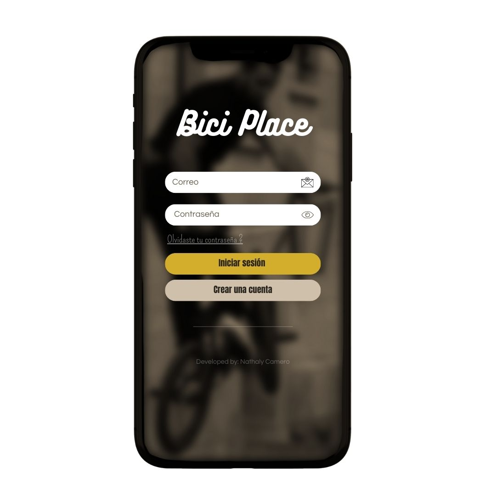

# Diseño de interfaz de usuario

La interfaz de usuario de la aplicación Bici Place esta inspirada en la interfaz de usuario de apliciones similares y en el uso de [Canva](https://www.canva.com/?msockid=138a4a6cd9d663cc3c7f5eb1d879623b).

El diseño completo esta disponible en [Canva](https://www.canva.com/design/DAGPLnN3uYI/pyOVnM7Hxp8m_7QMPR7WoA/edit?utm_content=DAGPLnN3uYI&utm_campaign=designshare&utm_medium=link2&utm_source=sharebutton). Se usaron colores como: amarillo, vinotinto, gris, negro, verde esmeralda, azul. 
A continuación se presentan las principales pantallas:

1. Inicio:

   Cuando el usuario ingrese a la aplicaicón verá una pantalla como esta.
    

2. Registro e inicio de sesión:
   
   Aquí, el usuario podrá iniciar sesión si ya tiene una cuenta o crear una nueva.
   

3. Lista de productos:
   
   El usuario podrá visualizar la lista de productos disponibles en cada sección: bicicletas, componentes y accesorios.
   
   
4. Ofertas disponibles:
   
   El usuario tendrá disponible una pestaña con una serie de ofertas para mayor ahorro.
   

5. Vender un producto:
    
   Si el usuario cumple con los requisitos, podrá vender sus productos.
   

6. Chat:
   
  El usuario tendrá la posibilidad de comunicarse con los distintos vendedores en caso de reclamos o preguntas sobre algún producto. Además, contará con un asistente
  personal y un apartado para quejas.
  
  
7. Perfil:
   
  El usuario podrá visualizar toda su información, como historial de compras, nombre de usuario, dirección, entre otros detalles.
  
